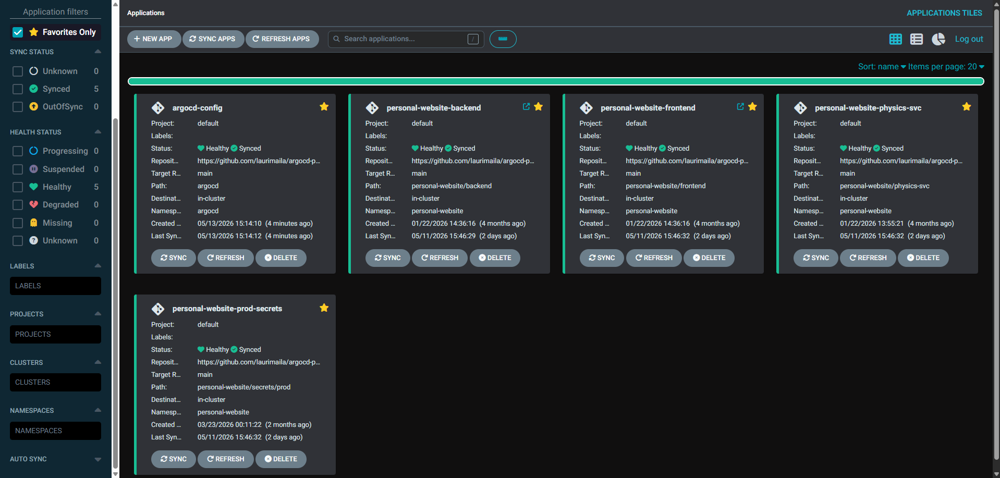

# ArgoCD GitOps configuration

This repository contains ArgoCD configuration for my personal website and its services. Images in all environments are automatically updated with [argocd-image-updater](https://github.com/argoproj-labs/argocd-image-updater). Secrets are handled using [External Secrets Operator](https://external-secrets.io/latest/) with OCI Vault.

**Production:** [https://prod.laurimaila.com](https://prod.laurimaila.com)

## Tech Stack

*   **Client:** Next.js, TypeScript, TailwindCSS
*   **Server:** ASP.NET Core
*   **Database:** PostgreSQL, Entity Framework, Drizzle
*   **CMS:** Directus
*   **Deployment:** K8s, Helm, ArgoCD

## Project Structure

*   `argocd/`: Contains the ArgoCD `Application` custom resources that define the applications to be deployed. Also contains configurations for e.g. the image updater and ingress.
*   `/personal-website`: Holds the Helm charts for the different components of the application, e.g. `backend` and `frontend`. Charts for the components use images built in their respective repositories.
*   `/logging`: Contains manifests for PLG (Prometheus, Loki, Grafana) observability stack, which aggregates logs and performance data from all pods in the cluster.
